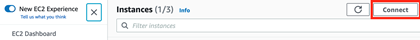

# **Network Access Analyzer Multi-Account Analysis**

## **Table of Contents**

1. [Summary](#summary)
2. [Overview](#overview)
3. [Prerequisites](#prerequisites)
4. [Implementation Procedure](#implementation-procedure)
5. [Future Analysis Executions](#future-analysis-executions)
6. [Exclusions](#exclusions)
7. [Appendix](#appendix)

## **Summary**

[Network Access Analyzer](https://docs.aws.amazon.com/vpc/latest/network-access-analyzer/what-is-network-access-analyzer.html) is a VPC feature that identifies unintended network access to your resources on AWS. You can use Network Access Analyzer to specify your network access requirements and to identify potential network paths that do not meet your specified requirements.

This solution has been built to extend the functionality of organization-wide analysis, finding exclusion, and export to CSV and/or Security Hub which does not yet exist natively within Network Access Analyzer. (Future roadmap items)

The default design of the script is to deploy a single common Network Access Analyzer scope across all AWS accounts and specified regions to identify all permitted data paths originating from the Internet (IGW) to an ENI (Elastic Network Interface).  
The findings are then processed via a Python script, data extracted, and then a consolidated CSV file is created and uploaded to a provisioned S3 bucket, and/or import into Security Hub.

## **Overview**

Step by step instructions are provided (NetworkAccessAnalyzerProcedure.md) to deploy this solution.

Resources are provisioned via CloudFormation templates with tunable parameters at the time of deployment, as well as through the naa-script.sh script.

Bash scripting was used to automate the provisioning and analysis of Network Access Analyzer scopes across multiple AWS accounts in parallel.

Once findings are reviewed, intended findings can be excluded from future finding output by adding them to the naa-exclusions.csv file and unintended findings remediated.

[AWS re:Inforce 2022 - Validate effective network access controls on AWS (NIS202)](https://youtu.be/aN2P2zeQek0)

## **Prerequisites**

- The default behavior of the naa-script.sh script is to leverage the IAM Role attached to the EC2 Role in order to assume an IAM Role in the ORG root account and generate a list of all member accounts in the AWS Org.  This behavior requires AWS Organizations to be provisioned and the member accounts associated with the AWS Organization.

- If the environment is not using AWS Organizations, the supplied CloudFormation template for IAM Role NAAExecRole may require modified deployment steps which are appropriate for the environment and the naa-script.sh script will need to be modified to utilize one of the supported options where the AWS Account ID are supplied to the script.

- Accessing the EC2 Instance via Systems Manager Session Manager requires that the EC2 instance have output Internet access so that the SSM Agent can reach the SSM service endpoint. The EC2 instance should be deployed in a private subnet with outbound Internet access (Via NAT Gateway or VPC Endpoints), however if it is deployed in a public subnet, an Elastic IP may need to be attached to the instance with the appropriate routing

- If using the Findings to Security Hub feature, Security Hub must be enabled in the account and region where the NetworkAccessanalyzerEC2 instance is provisioned.

## **Implementation Procedure**

1. Deploy the EC2 instance and supporting resources (naa-resources.yaml)  
    >Note: When deploying the CFT template, it will provision an IAM Role, S3 Bucket with policy, SNS Topic, and EC2 instance which will be used by the Network Access Analyzer script.
    1. Select an account where the Network Access Analyzer EC2 instance will be provisioned.
    2. Open the CloudFormation console
    3. Create Stack -\> With new resources
    4. Prerequisite - Prepare template: "Template is ready"
    5. Specify template: "Upload a template file" -\> "Choose File" -\> Browse for the template
        - Specify the naa-resources.yaml template
    6. Next
    7. Specify stack details
        - StackSet name: NAA-Resources
        - Parameters:
            - VPCId: Select a VPC in the account
            - SubnetId: Select a private subnet which has Internet access
                >Note: If a public subnet is selected, the EC2 instance will not provision as the CFT doesn't attach an EIP by default
            - InstanceType: Leave the default Instance type and size unless it's not present in the AWS Partition being deployed to
            - InstanceImageId: Leave the default for Amazon Linux 2
            - KeyPairName: Specify the name of an existing KeyPair if using SSH for access (This is optional and can be left blank)
            - PermittedSSHInbound: If using SSH for access, specify a permitted CIDR
            - BucketName: Leave the default unless necessary
            - EmailAddress: Specify an email address for a SNS notification when Network Access Analyzer completes the analysis and uploads the files to S3.
                >Note: The SNS subscription configuration must be confirmed prior to Network Access Analyzer completing the analysis or a notification will not be sent.
            - NAAEC2Role: Leave the default unless necessary
            - NAAExecRole: Leave the default unless necessary
            - Parallelism: Specify the number of parallel assessments to perform.
            - Regions: Specify regions to analyze with Network Access Analyzer
            - ScopeNameValue: Specify the name tag which will be assigned to the scope. This tag is used to locate the scope for analysis
            - ExclusionFile: Specify the exclusion file name which will be removed from output during the JSON data parsing
            - FindingsToCSV: Specify if findings should be output to CSV
            - FindingsToSecurityHub: Specify if findings should be import into Security Hub
            - EmailNotificationsForSecurityHub: Specify if findings imported into Security Hub should generate email notifications
            - ScheduledAnalysis: Schedule automated analysis via cron. If true, the CronScheduleExpression parameter is used, else it is ignored (Note: After initial EC2 provisioning, /etc/cron.d/naa-schedule mus be manually deleted to remove the cron schedule)
            - CronScheduleExpression: Specify the frequency of Network Access Analyzer analysis via cron expression (e.g. Midnight on Sunday 0 0 \* \* 0 OR Midnight on First Sunday of each month 0 0 * 1-12 0) (Note: After initial EC2 provisioning, /etc/cron.d/naa-schedule must manually adjusted)
    8. Next
    9. Next
    10. Review the summary
    11. Check the box for "The following resource(s) require capabilities: [AWS::IAM::Role]" and Create Stack
    12. Once the Stack has finished deploying, click the Outputs tab in the CloudFormation console and copy the NAAEC2Role ARN for use with the next CloudFormation template deploys.

2. Deploy the IAM cross account role to all AWS organization member accounts (naa-execrole.yaml)  
    >Note: The easiest way to do this is to utilize service-managed permissions when deploying the stack and deploying to the entire organization.
    > > This will require trust to be established between CloudFormation and the AWS Organization. If it is not already established, the CloudFormation console for StackSets will present a button which should be clicked and states "Enable trusted access with AWS Organizations to use service-managed permissions."
   1. Open the CloudFormation console
   2. Click StackSets
   3. Click "Create StackSet"
   4. Permissions: Service-managed permissions
   5. Prerequisite - Prepare template: "Template is ready"
   6. Specify template: "Upload a template file" -\> "Choose File" -\> Browse for the template.
       - Specify the naa-execrole.yaml template.
   7. Next
   8. Specify StackSet details
        - StackSet name: NAA-ExecRole
        - Parameters:
            - AuthorizedARN: Specify the NAAEC2Role ARN which was provisioned as part of the naa-resources.yaml stack.
            - NAARoleName: Leave the default (NAAExecRole)
   9. Deployment targets: Leave "Deploy to organization" selected along with defaults
   10. Specify regions: Select a single region as IAM is global. (E.g., Use the region the Network Access Analyzer EC2 Instance will be deployed in)
   11. OPTIONAL: Specify Deployment Options: Set BOTH "Maximum concurrent accounts" and "Failure tolerance" to a high number (E.g. 100) to have the stacks deploy to this number of AWS accounts simultaneously.
   12. Next
   13. Review the summary
   14. Check the box to approve "I acknowledge that AWS CloudFormation might create IAM resources with custom names."
   15. Submit
    >Note: Monitor the "Stack instances" (Individual account status) and Operations (Overall) tabs to determine when the deploy is completed.

3. Deploy the IAM cross account role to the AWS organization management account (naa-execrole.yaml)  
    >Note: This deployment is direct to the management account as the StackSet deployed previously does not include the management account.
    1. Open the CloudFormation console
    2. Create Stack -\> With new resources
    3. Prerequisite - Prepare template: "Template is ready"
    4. Specify template: "Upload a template file" -\> "Choose File" -\> Browse for the template
        - Specify the naa-execrole.yaml template
    5. Next
    6. Specify stack details
        - Stack name: NAA-ExecRole
        - Parameters:
            - AuthorizedARN: Specify the NAAEC2Role ARN which was provisioned as part of the NAA-Resources stack.
            - NAARoleName: Leave the default (NAAExecRole)
    7. Next
    8. Next
    9. Review the summary
    10. Check the box for "The following resource(s) require capabilities: [AWS::IAM::Role]" and Create Stack

4. Log into the AWS account where the NAA Resources stack was deployed using SSM Connect and access the NetworkAccessAnalyzerEC2 Instance.
    >Note: SSM Access is granted as part of the IAM Role which is provisioned and attached to the EC2 instance. If unable to connect, validate the subnet has Internet access and reboot the instance as the agent needs to communicate with the AWS SSM endpoint.

    

5. Review the naa-script.sh script to validate settings and then execute to begin the analysis
    >Note: Screen will be used to allow the naa-script.sh script to continue executing if console access is lost. To resume a disconnected session, log back into the EC2 instance, sudo -i,  and execute screen -r (screen must be resumed by the same user it detached under)

    ```bash
    sudo -i
    screen
    cd /usr/local/naa

    vi naa-script.sh    #Or any other editor such as nano

    ./naa-script.sh
    ```

6. Monitor for any errors to make sure execution is working properly.
    >Note: The first time the script is executed, it will setup the naa-exclusions.csv file.  It will generate an error about not being able to download the file from the S3 bucket which is expected.  Subsequent executions, will not display an error.

7. Once the script completes, review the findings which have been uploaded to the S3 bucket  
    Unprocessed JSON from each account/region will be included in the zip file.

## **Future Analysis Executions**

- Automated via Cron:  
    If during deployment, the Cloudformation parameter "ScheduledAnalysis" was set to true, a cron file "/etc/cron.d/naa-schedule" will exist on the EC2 instance.  
    This cron entry will automatically execute the naa-script.sh based on the schedule set within the cron file.  
    If the schedule needs to be adjusted, the "/etc/cron.d/naa-schedule" file can be manually tuned with an editor.
- Manual:  
    Log into the EC2 instance and execute the commands to start the analysis:

    ```bash
    sudo -i
    screen
    cd /usr/local/naa
    ./naa-script.sh
    ```

## **Exclusions**

In order to exclude known good findings from analysis output, an exclusion process has been built.

- A variable named S3_EXCLUSION_FILE in naa-script.sh can be set to true (default) or false.
  - If true, the script will retrieve a copy of the EXCLUSIONS_FILE (default is naa-exclusions.csv) from S3_BUCKET
    - If a failure is generated, errors will be displayed, a local default local file will be created if it doesn't exist already, and then it will be uploaded to the S3 bucket.  
    - During script executions, the EXCLUSIONS_FILE which is present locally on the EC2 WILL BE OVERWRITTEN with the file located in the S3_BUCKET.  
  - If false, the script will generate a local EXCLUSIONS_FILE if it doesn't exist  
- Edit this file and specify details about findings (one per line) in the file to exclude them from the NAA finding output
  - If S3_EXCLUSION_FILE is true, edit the EXCLUSIONS_FILE in the S3 bucket and if false, edit the local EC2 EXCLUSIONS_FILE  
    Utilize the format: resource_id,secgroup_id,sgrule_cidr,sgrule_portrange,sgrule_protocol  
    e.g. eni-06332dd60bb1f9a02,sg-0d3ffa3243275bc9a,0.0.0.0/0,80 to 80,tcp  

## **Appendix**

### **Update To The Latest Repository Code**

Code updates are made to the GitHub repository to add new functionality and correct potential issues.  
In order to pull these updates into an existing deployment, a few steps must be made to preserve local script parameter values

1. Change to the directory of the cloned code
    - cd /usr/local/naa
2. Stash all local changes (e.g. custom parameters in naa-script.sh)
    - git stash
3. Pull the latest files from the repository
    - git pull
4. Merge the local stashed changes back into the pulled files
    - git stash pop

### **Script Variables**

- SPECIFIC_ACCOUNTID_LIST: List specific accounts (SPACE DELIMITED) if you wish to run the command only against those or leave "allaccounts" to detect and execute against all accounts in the AWS Org
    >Default Value: allaccounts
- REGION_LIST (SPACE DELIMITED): Specify regions to analyze with Network Access Analyzer
    >Default Value: us-east-1 - Initially set via CFT parameter
- IAM_CROSS_ACCOUNT_ROLE: The IAM Role name created for cross account execution
    >Default Value: NAAExecRole - Initially set via CFT parameter
- SCRIPT_EXECUTION_MODE:
    >Default Value: CREATE_ANALYZE
  - Specify CREATE_ANALYZE to direct the script to create Network Access Analyzer scopes (if they don't exist already) and analyze them
  - Specify DELETE to direct the script to delete Network Access Analyzer scopes which have been provisioned (located by scope name tag)
  - In order to REDEPLOY scopes, execute with DELETE mode to remove all scopes, modify the Network Access Analyzer JSON file, and then execute with CREATE_ANALYZE
- Configure SCOPE_NAME_VALUE to specify the name tag which will be assigned to the scope. This tag is used to locate the scope for analysis
    >Default Value: naa-external-ingress - Initially set via CFT parameter
- Configure EXCLUSIONS_FILE to specify exclusions which will be removed from output during JSON data parsing
    >Default Value: naa-exclusions.csv - Initially set via CFT parameter
- Configure SCOPE_FILE to specify the file which will contain the Network Access Analyzer scope to be deployed
    >Default Value: naa-scope.json
- Configure S3_BUCKET to specify the existing S3 bucket which will have findings uploaded to, as well as where the EXCLUSIONS_FILE may be located.
    >Default Value: Configured during deployment to utilize the S3 bucket provisioned by the CFT.
- Configure PARALLELISM for the number of accounts to process simultaneously
    >Default Value: 10 - Initially set via CFT parameter
- Configure S3_EXCLUSION_FILE is set to true by default.  This instructs the script to download the exclusion file present in s3://S3_BUCKET/EXCLUSIONS_FILE and overwrites the local copy on EC2 upon script execution.  
    Set to false to utilize a local exclusion file without the S3 download copy
    >Default Value: true
- Configure FINDINGS_TO_CSV to specify if findings should be output to CSV
    >Default Value: YES
- Configure FINDINGS_TO_SH to specify if findings should be import into Security Hub
    >Default Value: NO
