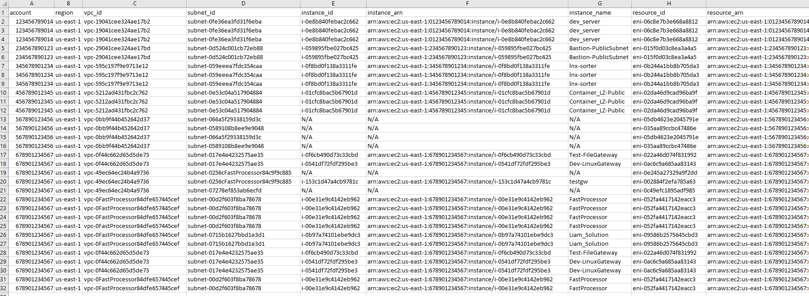

# Summary

[Network Access Analyzer](https://docs.aws.amazon.com/vpc/latest/network-access-analyzer/what-is-network-access-analyzer.html) is a VPC feature that identifies unintended network access to your resources on AWS. You can use Network Access Analyzer to specify your network access requirements and to identify potential network paths that do not meet your specified requirements.

This solution has been built to extend the functionality of organization-wide analysis, finding exclusion, and export to CSV which does not yet exist natively within Network Access Analyzer. (Future roadmap items)

# Overview

Step by step instructions are provided (NetworkAccessAnalyzerProcedure.md) to deploy this solution.

Resources are provisioned via CloudFormation templates with tunable parameters at the time of deployment, as well as through the naa-script.sh script.

Bash scripting was used to automate the provisioning and analysis of Network Access Analyzer scopes across multiple AWS accounts in parallel.

The default design of the script is to deploy a single common Network Access Analyzer scope across all AWS accounts and specified regions to identify all permitted data paths originating from the Internet (IGW) to an ENI (Elastic Network Interface).  
The findings are then processed via a Python script, data extracted to build a consolidated CSV file, and findings uploaded to a provisioned S3 bucket.

Once findings are reviewed, intended findings can be excluded from future CSV output by adding them to the naa-exclusions.csv file and unintended findings remediated.

[AWS re:Inforce 2022 - Validate effective network access controls on AWS (NIS202)](https://youtu.be/aN2P2zeQek0)

# Prerequisites 

- The default behavior of the naa-script.sh script is to leverage the IAM Role attached to the EC2 Role in order to assume an IAM Role in the ORG root account and generate a list of all member accounts in the AWS Org.  This behavior requires AWS Organizations to be provisioned and the member accounts associated with the AWS Organization.

- If the environment is not using AWS Organizations, the supplied CloudFormation template for IAM Role NAAExecRole may require modified deployment steps which are appropriate for the environment and the naa-script.sh script will need to be modified to utilize one of the supported options where the AWS Account ID are supplied to the script.

- Accessing the EC2 Instance via Systems Manager Session Manager requires that the EC2 instance have output Internet access so that the SSM Agent can reach the SSM service endpoint. The EC2 instance should be deployed in a private subnet with outbound Internet access (Via NAT Gateway or VPC Endpoints), however if it is deployed in a public subnet, an Elastic IP may need to be attached to the instance with the appropriate routing

# Limitations

Network Access Analyzer analyzes resources within a single account.  Cross account dataflows are not currently processed. (Future Network Access Analyzer roadmap item)

# Target technology stack  

VPC (Network Access Analyzer) / EC2 / S3 / SNS  / IAM / Python

# Target architecture 

The architecture of this solution uses to assess environments is comprised of a few key components.

An IAM Role (NAAEC2Role) is provisioned in an account where the EC2 based NAA analysis instance will be provisioned

An EC2 instance is provisioned, the NAAEC2Role attached, and the EC2 instance prepared with all dependencies via EC2 UserData

An IAM Role is (NAAExecRole) is provisioned in the Org root account, as well as all member accounts which allow for cross-account assume by the NAAEC2Role

NAA Scopes are deployed in each member account and analyzed via bash script automation

All findings are consolidated on the EC2 instance, processed, and uploaded to a S3 bucket which is created during the initial solution deployment.

# Automation and scale

Large scale deployment and automation are achieved through the use of bash scripting.  The CLI capabilities of Network Access Analyzer are leveraged.

# Example Output (Sanitized)

**AWS Account list generation**  

**AWS Account Analysis**  

**Report Example (Split into two halves)**  

# Files

- NetworkAccessAnalyzerProcedure.md:  
    Step by step instructions for provisioning IAM Roles, EC2 Instance, and usage.

- naa-script.sh:  
    Bash script used for processing of Network Access Analyzer scopes in AWS accounts.  Bash script can facilitate the processing of all AWS accounts in an ORG or specific accounts, as well as single or multiple regions. Processing of accounts is performed in parallel. By default, this script utilizes the IAM Role attached to the EC2 Role to assume the IAM role NAAExecRole in the management account to generate a list of member accounts in the AWS Org. The script then uses this list of accounts to provisions a Network Access Analyzer scope in the accounts if one doesn’t exist.  It then performs analysis of the scope to identify findings. Once analysis is completed, findings out exported to the EC2 Instance.  Next, findings (JSON format) are processed to output a consolidated CSV file containing all non-excluded findings into a single file.  Once all accounts have been assessed, the individual CSV files will be concatenated, duplicate lines removed, and all output files zipped. Finally, the findings file is uploaded to the S3 bucket which was provisioned as part of this solution. 
    >Note: This script has tunable variables within the script itself (See appendix for more details). This script is provided independently from the CFT for reference.

- naa-resources.yaml:  
    A CFT which is deployed in the account where the NAA EC2 instance will be deployed.  This template will deploy all necessary dependencies in order for the bash script to perform deployment, analysis, and export with Network Access Analyzer.  The IAM-NAAExecRole is dependent on this template being deployed first.  Note: If this stack is deleted and redeployed, the NAArExecRole StackSet will need to be re-deployed to rebuild the cross-account dependency between IAM Roles.

- IAM-NAAExecRole.yaml:  
    A CFT to be deployed via StackSet across all member accounts (including the AWS Org Root/Management account). This will create an IAM Role which can be assumed by the NAA script during processing.

- naa-exclusions.csv:  
    CSV formatted file which allows known good findings to be excluded from future analysis finding output. Findings are pattern matched and must be exact.  

    Format:  
    resource_id,secgroup_id,sgrule_cidr,sgrule_portrange  
    eni-06335dd6bbb1f9a02,sg-0d3fda324d275bc9a,0.0.0.0/0,80 to 80  

- naa-findings2csv.py:  
    Python script which extracts specific fields from the JSON output and exports non-excluded findings into a CSV file.

# Deployment

1. Deploy CloudFormation Templates:  
   1. In the account which will host an EC2 instance and the bash script is executed from, deploy the naa-resources.yaml template  
   This will deploy the EC2 Instance, S3 Bucket, SNS Topic, IAM Role for use with EC2, and all dependencies the script requires to execute.  
   2. In the AWS Org root or a CloudFormation delegated admin account, deploy the naa-execrole.yaml as a service-managed stackset to the entire AWS Org in a single region (IAM Roles are global across all regions).  
   Specify the ARN of the NAAEC2Role deployed in step 1.1  
   3. In the AWS Org root, deploy the naa-execrole.yaml.  
   The StackSet will not include the Management account. 
   Specify the ARN of the NAAEC2Role deployed in step 1.1

2. Log into the EC2 instance with SSM Connect and update the variables of the naa-script.sh file.  
   sudo -i  
   Use vi /usr/local/naa/naa-script.sh and review the top portion of the script  
    - SPECIFIC_ACCOUNTID_LIST: List specific accounts (SPACE DELIMITED) if you wish to run the command only against those or leave allaccounts to detect and execute against all accounts in the AWS Org
    - REGION_LIST (SPACE DELIMITED): Specify regions to execute commands in
    - IAM_CROSS_ACCOUNT_ROLE: The IAM Role name created for cross account.
    - SCRIPT_EXECUTION_MODE:
        - Specify CREATE_ANALYZE to direct the script to create NAA scopes (if they don't exist aleady) and analyze them
        - Specify DELETE to direct the script to delete NAA scopes which have been provisioned (located by scope name tag)
        - In order to REDEPLOY scopes, execute with DELETE mode to remove all scopes, modify the NAA JSON file, and then execute with CREATE_ANALYZE
    - Configure SCOPE_NAME_VALUE to specify the name tag which will be assigned to the scope.  This tag is used to locate the scope for analysis
    - Configure EXCLUSIONS_FILE to specify exclusions which will be removed from output during the json to csv conversion
    - Configure SCOPE_FILE to specify the file which will contain the Network Access Analyzer scope to be deployed
    - Configure S3_BUCKET to specify the existing S3 bucket which will have findings uploaded to, as well as where the exclusion_file may be located
    - Configure PARALLELISM for the number of accounts to process simultaneously
    - Configure S3_EXCLUSION_FILE is set to true by default.  This instructs the script to download the exclusion file present in s3://S3_BUCKET/EXCLUSIONS_FILE and overwrites the local copy on EC2 upon script execution.  
    Set to false to utilize a local exclusion file without the s3 download copy

3. Execute the script with with screen  
    In order to avoid a timeout to session manager or the ssh session when executing the script, run screen first and then /usr/local/bin/naa/naa-script.sh  
    If a disconnection occurs while the script is executing, screen will keep the process alive.  
    To resume a disconnect session, log back into the EC2 instance, sudo -i,  and execute screen -r (screen must be resumed by the same user it detached under)

4. Monitor for any errors which may be related to missing permissions from the IAM execution role or binaries which need to be added to the server.

5. Once the script completes, review the findings which have been uploaded to the S3 bucket  
    Unprocessed JSON from each account/region will be included in the zip file.

# Add Exclusions

1. A variable named S3_EXCLUSION_FILE is set to true by default.  This will instruct the script to attempt a retrieve of the exclusion file EXCLUSIONS_FILE (default is naa-exclusions.csv) from S3_BUCKET (automatically set to the S3 bucket which was provisioned during the CFT deploy).  
   - If a failure is generated, errors will be displayed and a local default local file will be created if it doesn't exist already.  
   - The EXCLUSIONS_FILE which is present locally on the EC2 WILL BE OVERWRITTEN with the file located in the S3_BUCKET.  
   - If you are leaving the variable S3_EXCLUSIONS_FILE to true, make sure to place the EXCLUSION_FILE within the S3 bucket.
   - If the variable S3_EXCLUSIONS_FILE is set to false, the script will NOT attempt to retreive the file from S3 and will use the local file only.
   
2. Edit this file and specify details about findings (one per line) to the file to exclude them from the NAA finding output  
   Utilize the format: resource_id,secgroup_id,sgrule_cidr,sgrule_portrange  
   e.g. eni-06332dd60bb1f9a02,sg-0d3ffa3243275bc9a,0.0.0.0/0,80 to 80  

3. Upload the modified exclusion file to the S3 bucket OR set S3_EXCLUSION_FILE to false and utilize the local exclusion file

# References:

[What is Network Access Analyzer?](https://docs.aws.amazon.com/vpc/latest/network-access-analyzer/what-is-network-access-analyzer.html)  
[Network Access Analyzer Blog](https://aws.amazon.com/blogs/aws/new-amazon-vpc-network-access-analyzer/)  

# Link to APG Artifact (Authorized Access Only)

https://apg-library.amazonaws.com/content/111111111111111111111fix