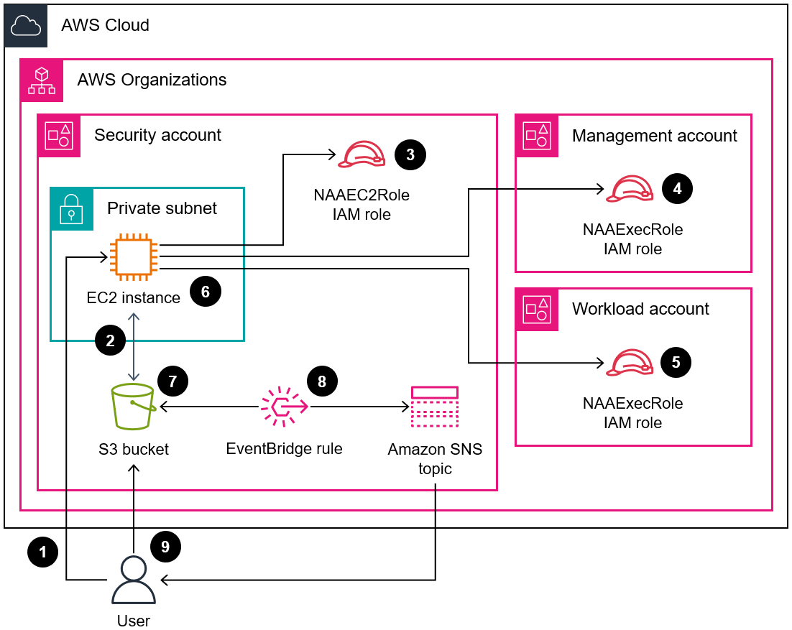
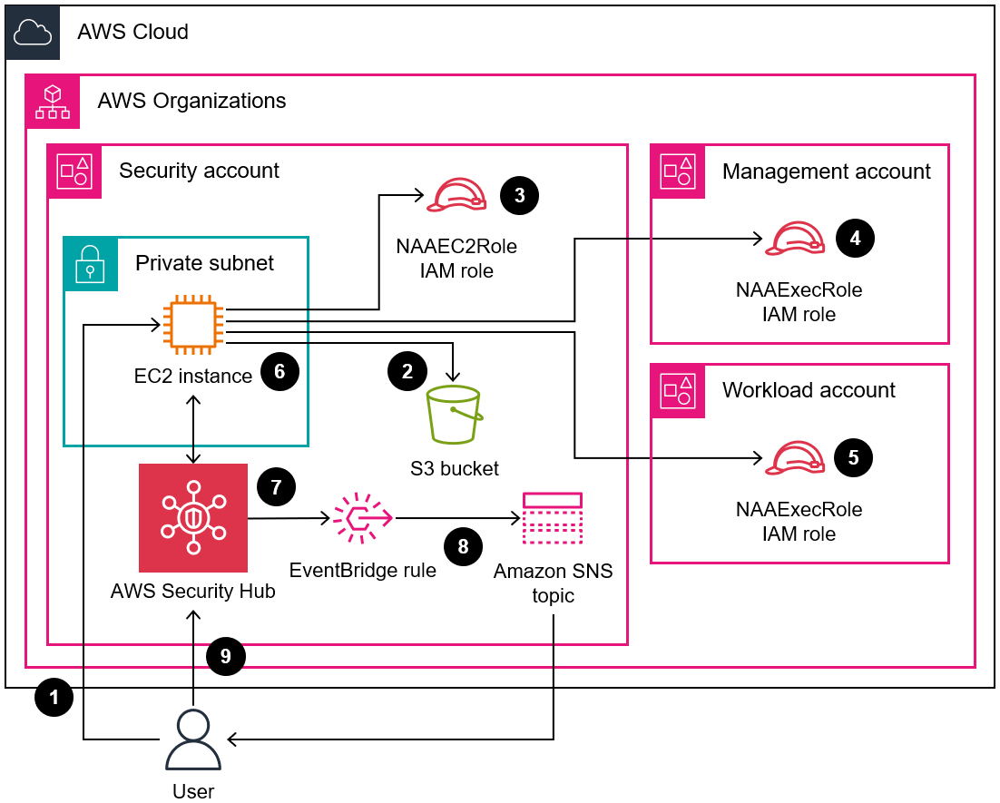

# **Create a report of Network Access Analyzer findings for inbound internet access in multiple AWS accounts**

## Summary

Unintentional inbound internet access to AWS resources can pose risks to an organization’s data perimeter. [Network Access Analyzer](https://docs.aws.amazon.com/vpc/latest/network-access-analyzer/what-is-network-access-analyzer.html) is an Amazon Virtual Private Cloud (Amazon VPC) feature that helps you identify unintended network access to your resources on Amazon Web Services (AWS). You can use Network Access Analyzer to specify your network access requirements and to identify potential network paths that do not meet your specified requirements. You can use Network Access Analyzer to do the following:

1. Identify AWS resources that are accessible to the internet through internet gateways.

2. Validate that your virtual private clouds (VPCs) are appropriately segmented, such as isolating production and development environments and separating transactional workloads.

Network Access Analyzer analyzes end-to-end network reachability conditions and not just a single component. To determine whether a resource is internet accessible, Network Access Analyzer evaluates the internet gateway, VPC route tables, network access control lists (ACLs), public IP addresses on elastic network interfaces, and security groups. If any of these components prevent internet access, Network Access Analyzer doesn’t generate a finding. For example, if an Amazon Elastic Compute Cloud (Amazon EC2) instance has an open security group that allows traffic from 0/0 but the instance is in a private subnet that isn’t routable from any internet gateway, then Network Access Analyzer wouldn’t generate a finding. This provides high-fidelity results so that you can identify resources that are truly accessible from the internet.  

When you run Network Access Analyzer, you use Network Access Scopes to specify your network access requirements. This solution identifies network paths between an internet gateway and an elastic network interface. In this pattern, you deploy the solution in a centralized AWS account in your organization, managed by AWS Organizations, and it analyzes all of the accounts, in any AWS Region, in the organization.  

This solution was designed with the following in mind:

- The AWS CloudFormation templates reduce the effort required to deploy the AWS resources in this pattern.
- You can adjust the parameters in the CloudFormation templates and naa-script.sh script at the time of deployment to customize them for your environment.
- Bash scripting automatically provisions and analyzes the Network Access Scopes for multiple accounts, in parallel.
- A Python script processes the findings, extracts the data, and then consolidates the results. You can choose to review the consolidated report of Network Access Analyzer findings in CSV format or in AWS Security Hub. An example of the CSV report is available in the Additional information section of this pattern.
- You can remediate findings, or you can exclude them from future analyses by adding them to the naa-exclusions.csv file.

## **Deployment steps and supplemental information provided via AWS Prescriptive Guidance (APG)**

[https://docs.aws.amazon.com/prescriptive-guidance/latest/patterns/create-a-report-of-network-access-analyzer-findings-for-inbound-internet-access-in-multiple-aws-accounts.html](https://docs.aws.amazon.com/prescriptive-guidance/latest/patterns/create-a-report-of-network-access-analyzer-findings-for-inbound-internet-access-in-multiple-aws-accounts.html)

​The code in this repository helps you set up the following target architectures (Either finding delivery option can be used or both):  
​
CSV Finding Output:

Security Hub Finding Import:

