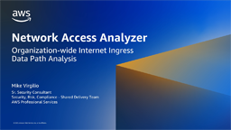
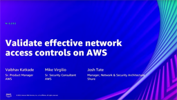
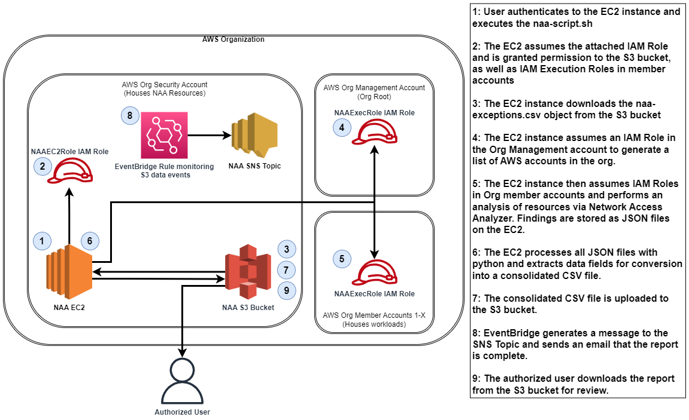
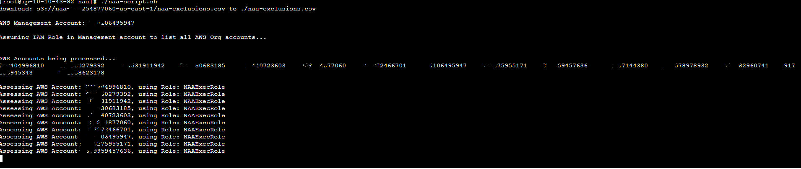
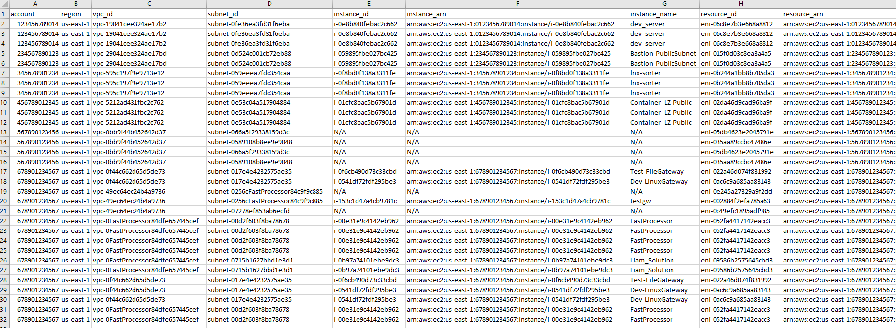
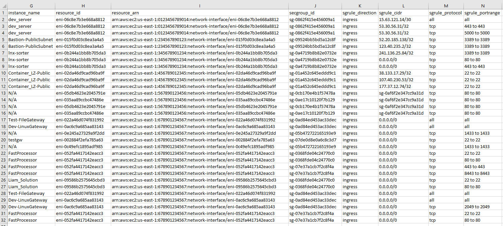
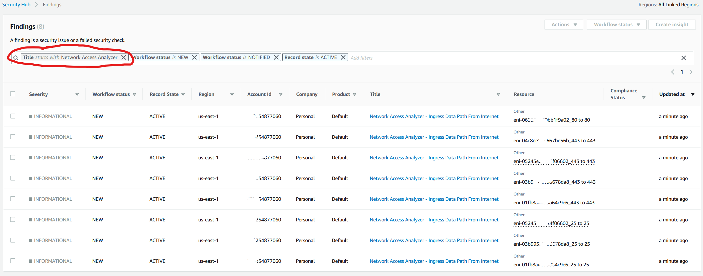
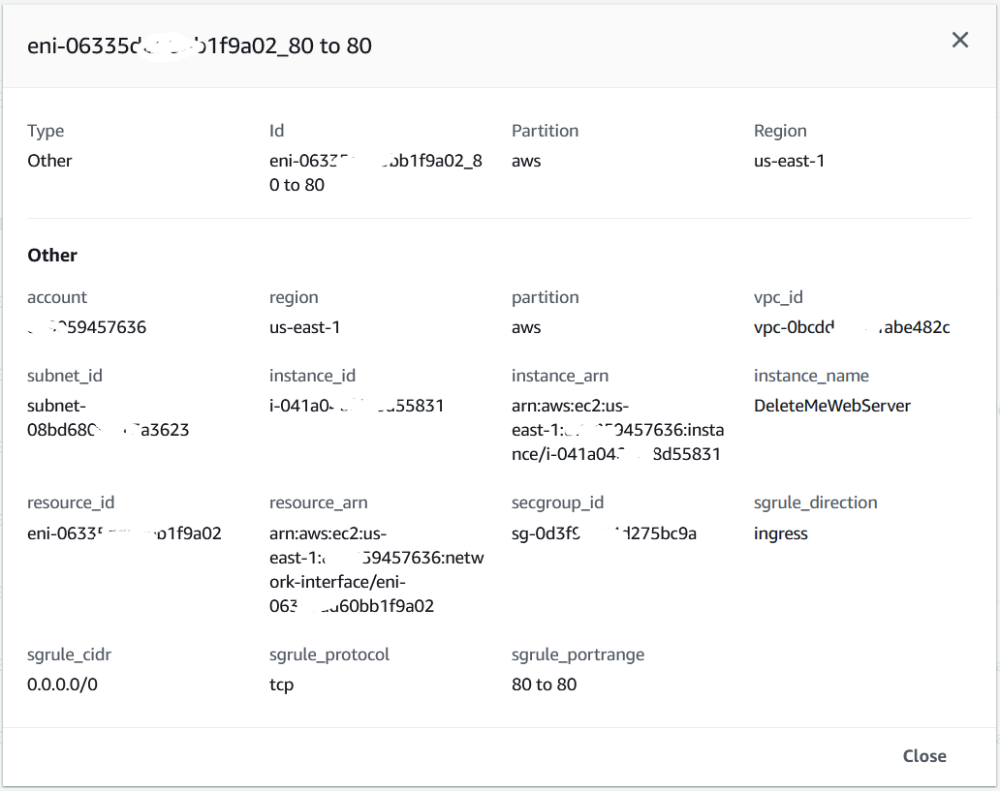
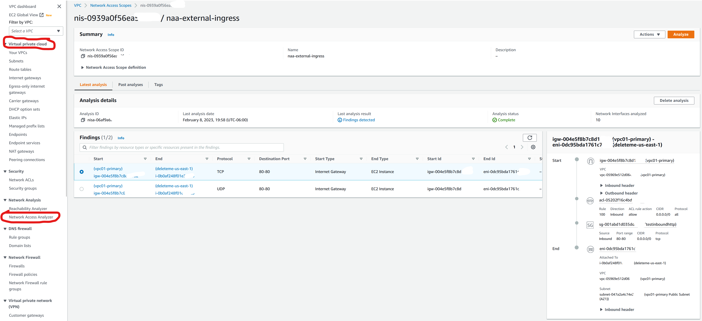

# **Network Access Analyzer Multi-Account Analysis**

## **Summary**

[Network Access Analyzer](https://docs.aws.amazon.com/vpc/latest/network-access-analyzer/what-is-network-access-analyzer.html) is a VPC feature that identifies unintended network access to your resources on AWS.  
You can use Network Access Analyzer to specify your network access requirements and to identify potential network paths that do not meet your specified requirements.  
Common ways you can use Network Access Analyzer is :

1. Identify resources in your account that have internet accessibility to Internet Gateway
2. Validate your VPCs are appropriately segmented.

**How is Network Access Analyzer different than other tools (AWS Trusted Advisor / AWS Firewall Manager) which identify Security Groups with overly permissive / higher-risk rules?**

Network Access Analyzer evaluates end-to-end network reachability conditions and not just a single component such as the Security Group during the analysis.  
As an example, in order to generate findings to show resources which are accessible from the Internet, the Internet, VPC Route Tables, Subnet NACLs, Public IP on ENI and Security Groups are all taken into account. If any of these components prevent the communication, a finding will not be generated.  
So, if an instance had an open security group allowing traffic from 0/0, but was in a private subnet that is not routable from any IGW, then no finding would be generated for that instance. This generates high fidelity findings of resources that indeed have network reachability from the Internet Gateway.

**The primary use case this solution solves is to identify all permitted data paths originating from the Internet (IGW - Internet Gateway) to Network Interfaces (ENI - Elastic Network Interface) within AWS Accounts across the entire AWS Organization.**  
This solution has been built to extend the functionality of organization-wide analysis, finding exclusion, and export to a CSV and/or import into Security Hub which does not yet exist natively within Network Access Analyzer.  

## **Overview**

**Step by step instructions are provided (NetworkAccessAnalyzerProcedure.md) to deploy this solution.**

Resources are provisioned via CloudFormation templates with tunable parameters at the time of deployment, as well as through the naa-script.sh script.  

Bash scripting is used to automate the provisioning and analysis of Network Access Analyzer scopes across multiple AWS accounts in parallel.  

A Network Access Analyzer scope is provisioned across all AWS accounts and specified regions.  

The findings are then processed via a Python script, data extracted, and then a consolidated CSV file is created and uploaded to a provisioned S3 bucket, and/or import into Security Hub.  

Once findings are reviewed, intended findings can be excluded from future finding output by adding them to the naa-exclusions.csv file and unintended findings remediated.

## **Videos**

[Demo - Organization-wide Internet Ingress Data Path Analysis Using Network Access Analyzer](https://youtu.be/1IFNZWy4iy0)  
  

[AWS re:Inforce 2022 - Validate effective network access controls on AWS (NIS202)](https://youtu.be/aN2P2zeQek0)  
  

## **Limitations**

Cross-account data flows are not currently processed at this time due to current limitations of the AWS VPC Network Access Analyzer feature.

## **Technology stack**

VPC (Network Access Analyzer) / EC2 / S3 / SNS  / IAM / Security Hub / Python

## **Solution Architecture**

## **Automation and scale**

Large scale deployment and automation are achieved through the use of bash scripting.  The CLI capabilities of Network Access Analyzer are leveraged.

Cron can be configured to automatically execute the /usr/local/naa/naa-script.sh on a schedule.  Initial configuration can be done via the CFT parameters.

## **Example Output (Sanitized)**

**AWS Account list generation**  

**AWS Account Analysis**  

**Report Example**  
CSV Output: (Split into two halves)  

Security Hub Findings Dashboard:  

Network Access Analyzer Dashboard (Per Account):  

## **Related Resources**

- NetworkAccessAnalyzerProcedure.md:  
    Step by step instructions for provisioning the solution and usage.

- naa-script.sh:  
    Bash script used for processing of Network Access Analyzer scopes in AWS accounts.  Bash script can facilitate the processing of all AWS accounts in an ORG or specific accounts, as well as single or multiple regions. Processing of accounts is performed in parallel. By default, this script utilizes the IAM Role attached to the EC2 Role to assume the IAM role NAAExecRole in the management account to generate a list of member accounts in the AWS Org. The script then uses this list of accounts to provisions a Network Access Analyzer scope in the accounts if one doesn’t exist.  It then performs analysis of the scope to identify findings. Once analysis is completed, findings out exported to the EC2 Instance.  Next, findings (JSON format) are processed to output a consolidated CSV file containing all non-excluded findings into a single file and/or imported into Security Hub.  Once all accounts have been assessed, the individual CSV files will be concatenated, duplicate lines removed, and all output files zipped. Finally, the findings file is uploaded to the S3 bucket which was provisioned as part of this solution.
    >Note: This script has tunable variables within the script itself (See appendix for more details).

- naa-resources.yaml:  
    A CFT which is deployed in the account where the NAA EC2 instance will be deployed.  This template will deploy all necessary dependencies in order for the bash script to perform deployment, analysis, and export with Network Access Analyzer.  The NAAExecRole IAM Role is dependent on this template being deployed first.  
    >Note: If this stack is deleted and redeployed, the naa-execrole Org StackSet and Management Stack will need to be re-deployed to rebuild the cross-account dependency between IAM Roles.

- naa-execrole.yaml:  
    A CFT to be deployed via StackSet across all member accounts (including the AWS Org Root/Management account). This will create an IAM Role which can be assumed by the NAA script during processing.

- naa-exclusions.csv:  
    >Note: This file will be created automatically during the initial script execution.
    The CSV formatted file which allows known good findings to be excluded from future analysis finding output. Findings are pattern matched and must be exact.  

    Format:  
    resource_id,secgroup_id,sgrule_cidr,sgrule_portrange,sgrule_protocol  
    eni-06335dd6bbb1f9a02,sg-0d3fda324d275bc9a,0.0.0.0/0,80 to 80,tcp  

    If resources such as EC2 are provisioned behind a loadbalancer using Auto Scaling Group (ASG), the resource_id will change as instances are provisioned.  
    In the case, the entire loadbalancer and all resources behind it can be excluded by adding the loadbalancer_id to the EXCLUSIONS_FILE  
    Utilize the format: loadbalancer_id,,,,  
    e.g. app/MyELB/346ge44ebd488fee,,,,  
  >Note: Both exclusion formats can be combined in the same file

- naa-processfindings.py:  
    Python script which extracts specific fields from the JSON output and exports non-excluded findings into a CSV file and/or Security Hub.

## **References**

[What is Network Access Analyzer?](https://docs.aws.amazon.com/vpc/latest/network-access-analyzer/what-is-network-access-analyzer.html)  
[Network Access Analyzer Blog](https://aws.amazon.com/blogs/aws/new-amazon-vpc-network-access-analyzer/)

## **Link to APG Pattern (Authorized Access Only)**

[https://apg-library.amazonaws.com/content/eda6abba-632a-4e3d-92b9-31848fa6dead](https://apg-library.amazonaws.com/content/eda6abba-632a-4e3d-92b9-31848fa6dead)
